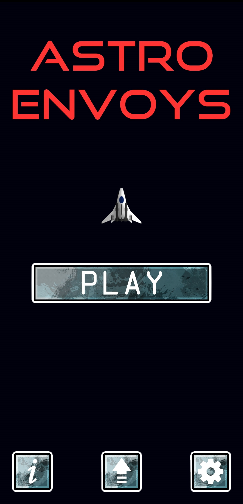
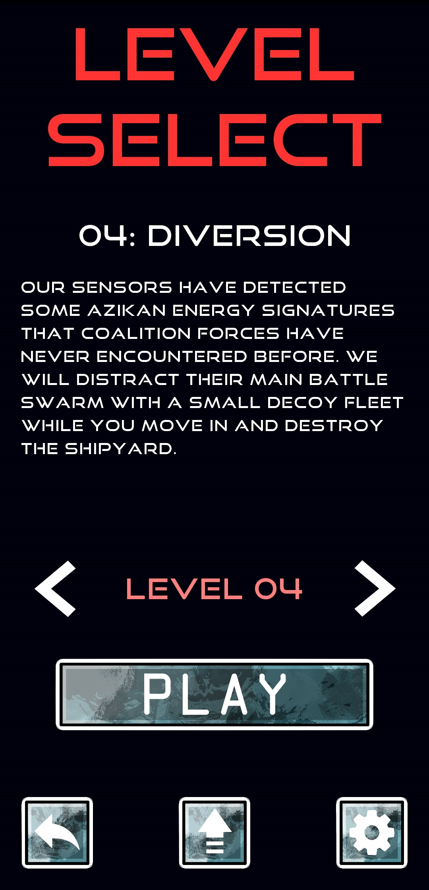
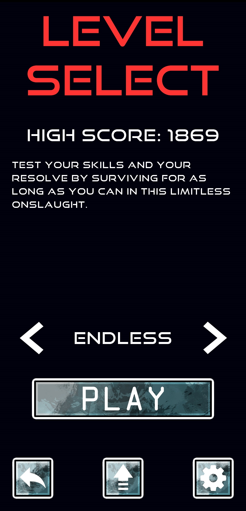
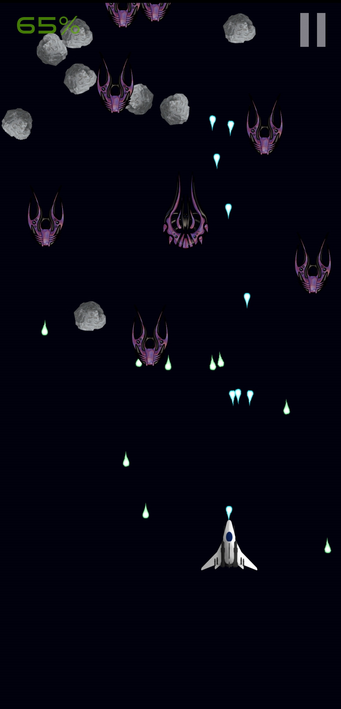
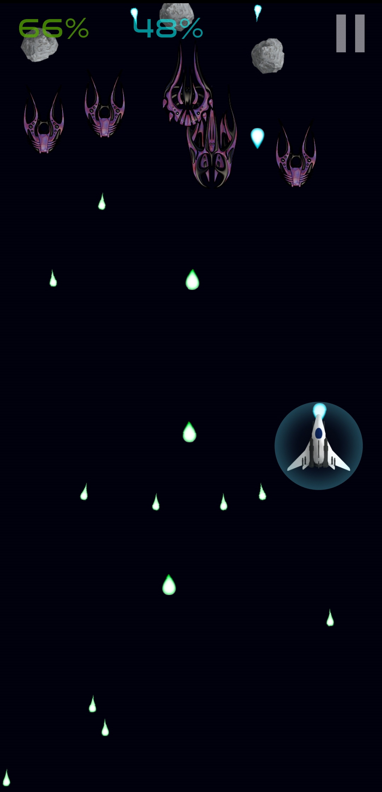
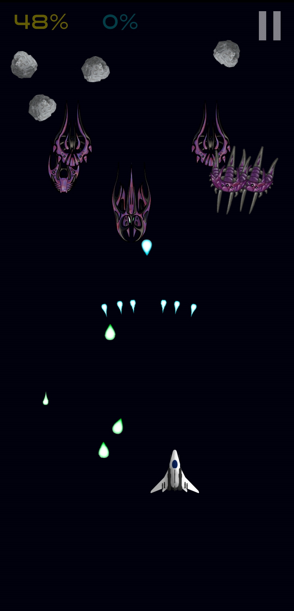

# Astro Envoys
This is a mobile space shooter I created in 2020 using LibGDX and Android Studio.

## Installation
1. Download [astro-envoys-1.0.1.apk](./astro-envoys-1.0.1.apk) to your Android device
2. Locate the .apk file in your downloads or file system
3. Open the .apk file and install the application from (don't worry, it's safe)
4. Play the game!

I do not plan on uploading this game to Google Play so it must be manually installed.

## Features
- 5 types of enemies, including 1 boss
- 5 different unlockable weapon systems
- 5 campaign levels and one endless stage
- A sense of pride and accomplishment

## Screenshots
|  |  |  |
|-------------------------|-------------------------|-------------------------|
|  |  |  |

## Assets Used
Player ship from [Starfighter Pack 01 by Wobblegut Studios](https://wobblegut-studios.itch.io/sf01) \
Enemies from [Alien Top-down Ships by MillionthVector](http://millionthvector.blogspot.com/2013/07/free-alien-top-down-spaceship-sprites.html) \
[Azikan Sniper](./android/assets/az_sniper.png), [Projectiles](./android/assets/projectiles.png) and [Shield](./android/assets/shield.png) are my own \
[Asteroid](./android/assets/asteroid.png) and [Buttons](./android/assets/buttons.png) from unknown/unavailable source \
Main font is [Good Times by Typodermic Fonts](https://www.dafont.com/good-times.font)
